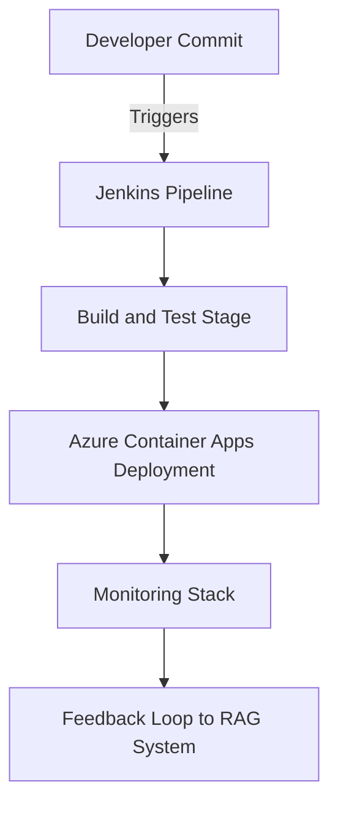

# 🚀 Hector Techno Docs Hub

Welcome to **Hector’s Technical Documentation Hub**, a centralized place where I showcase my **DevOps, AI, Cloud Engineering and 3D** projects.

This hub is designed as a **live, navigable portfolio** — each project includes architecture diagrams, stack descriptions, embedded demos, and links to source repositories.

---

## 🧩 Structure Overview

| Category | Description |
|-----------|--------------|
| 🤖 **AI Projects** | Generative AI, LLM integrations, Self-healing systems and intelligent agents. |
| ⚙️ **DevOps Pipelines** | CI/CD systems, automation workflows, and pipeline templates. |
| ☁️ **Cloud Automation** | Infrastructure as Code (IaC), deployments, and cloud-native designs. |
| 📊 **Data Systems** | Monitoring, observability, and analytics infrastructure. |
| 🎮 **AR/VR & 3D Projects** | Augmented/Virtual Reality, 3d Experiences, Assets for multiple projects. |
| 🧩 **Other Projects** | Smaller utilities, experimental tools, and cross-domain prototypes. |


---

## 🧱 Architecture Example (Mermaid)


This diagram illustrates a typical end-to-end workflow for one of my cloud-integrated DevOps systems.
Each individual project contains its own version of a similar architecture adapted to its scope.

---

## 🧠 Features of this Hub

- Built with Docsify for fast static documentation.
- Uses Mermaid for architecture diagrams.
- Embeds live demos and documentation with responsive iframes.
- Organized in categories to reflect professional engineering domains.
- Easily extendable via scripts/add-project-advanced.js.

---

## 🧰 Tech Stack Behind the Hub


- Docsify – static documentation generator
- Mermaid.js – diagrams & flowcharts
- Prism.js – syntax highlighting
- Custom scripts (Node.js) – automatic project page generation
- GitHub Pages / Netlify – for public hosting

---

## 🌐 Integration with My Portfolio

Each section of this hub can be embedded inside my React Three Fiber portfolio using iframes, or linked directly from specific project cards.

Example iframe embed (in your React component):


```javascript
<iframe
  src="https://yourusername.github.io/docs-hub/"
  style={{
    width: '100%',
    height: '90vh',
    border: 'none',
    borderRadius: '12px',
  }}
/>

```

---

## 📅 Next Steps
1. Run the command below to add a new project page:
```bash
node scripts/add-project-advanced.js

```
2. Choose a category and provide a short description.
3. Serve locally to preview:
```bash
docsify serve ./docs

```
4. Push your hub to GitHub and enable GitHub Pages under repo settings.


💬 Tip: You can also embed this entire Docsify Hub in your portfolio’s “Projects” page, or display specific categories (like AI or DevOps) using `<iframe>` filters or buttons
© 2025 Hector Techno Docs Hub — All rights reserved.

```yaml
## 📂 Final Recommended Structure

your-monorepo/
│
├── docs/
│ ├── index.html
│ ├── _sidebar.md
│ ├── README.md
│ └── projects/
│ ├── ai-agent-azure.md
│ ├── jenkins-pipelines.md
│ ├── monitoring-stack.md
│ └── ...
│
└── scripts/
└── add-project-advanced.js

```

---


> Maintained by **@hmosqueraturner** – CTO & AI/DevOps Expert