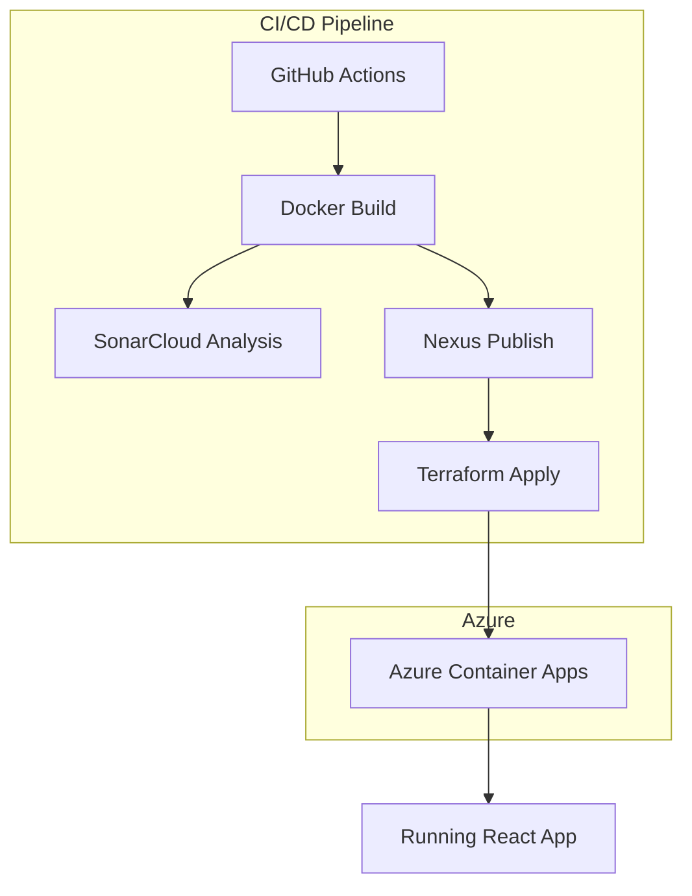

# ⚙️ ACiD

## Description
Project demonstrating modern DevOps practices for elaborating custom suites for building, testing, packaging, and deploying applications using costom tools from SCM to Deploy providers.

---

## Diagram

>🚧 Real architectures in progress.

---

## Embedded demo
> 🔗 [See full documentation at](https://hmosqueraturner.github.io/ACiD/)

<iframe
  src="https://hmosqueraturner.github.io/ACiD/"
  width="100%"
  height="800"
  style="border:none;border-radius:12px;">
</iframe>
---

## Stack
- **Github Actions, Jenkins**
- **Terraform + Bicep**
- **Ansible, Maven, JUnit**