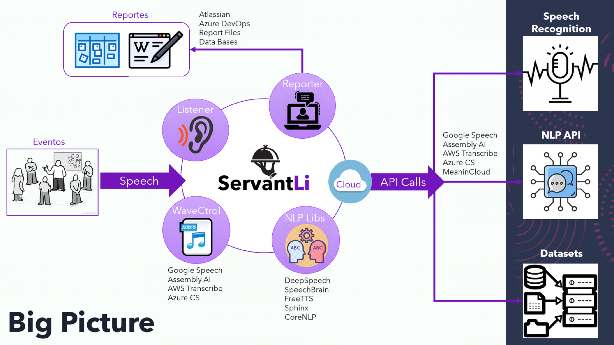

# 🤖 AI Agent for Azure

## Description
Artificial intelligence agent deployed on Azure, integrated with:
- JIRA + XRAY for test management
- Bitbucket + Jenkins for CI/CD
- Azure OpenAI for contextual inference and analysis

---

## Architecture

---

## Embedded demo
> 🔗 [See full documentation at](https://github.com/hmosqueraturner/ACiD/)

---

<iframe
  src="https://github.com/hmosqueraturner/ACiD/"
  width="100%"
  height="800"
  style="border:none;border-radius:12px;">
</iframe>
---

## Stack
- **LangChain + Azure OpenAI**
- **Jenkins Pipelines**
- **JIRA Automation + Webhooks**
- **Python + FastAPI**
