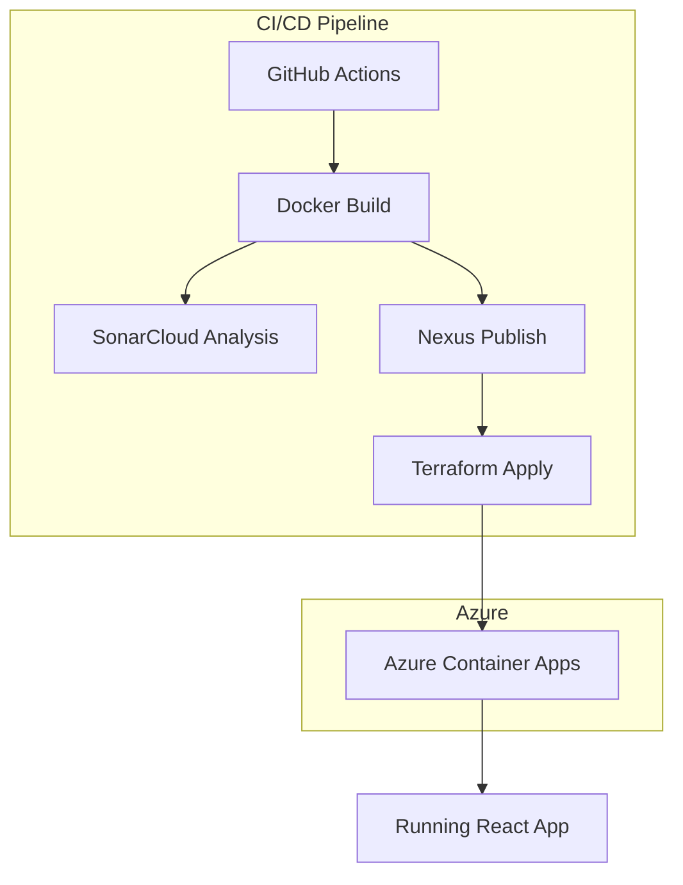

# 📦 Azure Container App Demo

## Description
A comprehensive example of aplication infraestructure managed in Azure Container Apps using Bicep and Docker.

This complete project is generated using **ACiD by @hmosqueraturner**

---

## Diagram



## 🔗 Azure Resources

- **Azure Container Apps**: Hosts APIs and jobs.
- **Azure Container Registry (ACR)**: Stores container images.
- **Azure Cosmos DB**: Stores test case data.
- **Azure Cognitive Search**: Indexes test cases for fast querying.
- **Azure Blob Storage**: Stores generated JSON reports.
- **Managed Identity**: Secures resource access.
- **Log Analytics**: Centralized logging.

---

## 🛠️ Deployment

1. **Provision Azure resources**  
   Use the Bicep files in [infra/](infra) to deploy all required resources:
   ```sh
   az deployment group create \
     --resource-group <your-rg> \
     --template-file infra/main.bicep \
     --parameters @infra/parameters/dev.parameters.json
   ```

2. **Build and push Docker images**  
   Build each app and push to ACR:
   ```sh
   docker build -t <acr>.azurecr.io/create-campaign:latest apps/create-campaign
   docker build -t <acr>.azurecr.io/evaluate-release:latest apps/evaluate-release
   docker build -t <acr>.azurecr.io/update-rag:latest apps/update-rag
   docker build -t <acr>.azurecr.io/front-react:latest apps/front-react
   docker push <acr>.azurecr.io/<app>:latest
   ```

3. **Deploy container apps**  
   Container Apps are deployed via Bicep modules in `main.bicep`.

---

## ⚙️ Configuration

- **Secrets and environment variables** are managed via Azure Managed Environments and referenced in Bicep files ([infra/infra-secrets.bicep](infra/infra-secrets.bicep)).

  ```env
  REACT_APP_EVALUATE_API=https://<your-api-evaluate>.azurecontainerapps.io/evaluate
  REACT_APP_JSON_URL=https://<your-storage>.blob.core.windows.net/<container>/result.json
  ```

---

## 🖼️ Screenshots & Diagrams

-  
-  
- 

---

## 📚 References

- [Azure Container Apps Documentation](https://learn.microsoft.com/en-us/azure/container-apps/)
- [Azure Bicep Documentation](https://learn.microsoft.com/en-us/azure/azure-resource-manager/bicep/)

---

## 📝 Notes

- Replace all image references (`assets/*.png`) with your own screenshots or diagrams.
- Update environment variables and secrets according to your Azure setup.
- For production, review security and access policies for all resources.

---

> Maintained by **@hmosqueraturner** – CTO & AI/DevOps Expert
---
