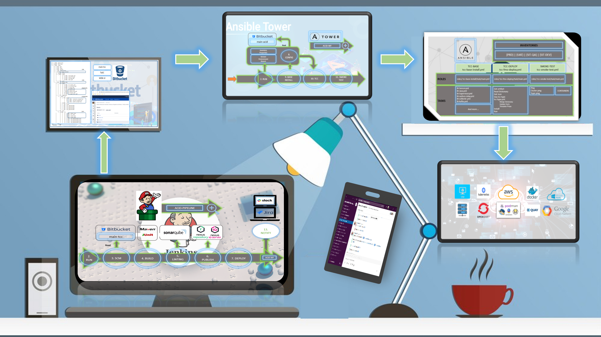

# ☁️ Cloud Automation

## Description
Infrastructure as code (IaC) for automated multi-environment deployments using **Bicep**, **Terraform** and **Ansible**.

---

## Diagram

---

## Embedded demo
> 🔗 [See full documentation at](https://github.com/hmosqueraturner/acid-one)

<iframe
  src="https://github.com/hmosqueraturner/acid-one"
  width="100%"
  height="800"
  style="border:none;border-radius:12px;">
</iframe>

---

## Stack
- **Azure Bicep / Terraform**
- **Ansible + Jenkins**
- **Monitoring on Grafana**
