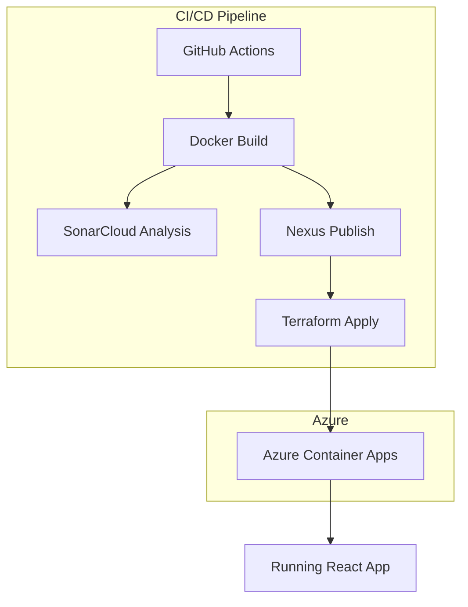

# ⚙️ DevOps Pipeline Demo

## Description
A comprehensive example project demonstrating modern DevOps practices for building, testing, packaging, and deploying a simple Node.js (React) application using GitHub Actions, Terraform, and Azure Container Apps.

This complete project is generated using **ACiD by @hmosqueraturner**

---

## Diagram

---

## Embedded demo
> 🔗 [See full documentation at](https://hmosqueraturner.github.io/ideal-cicd-one/)

<iframe
  src="https://hmosqueraturner.github.io/ideal-cicd-one/"
  width="100%"
  height="800"
  style="border:none;border-radius:12px;">
</iframe>
---

## Stack
- **Bitbucket Pipelines + Jenkins**
- **Azure Container Apps + Bicep**
- **Playwright + JUnit**
- **Flowise RAG** for automatic test cases validation