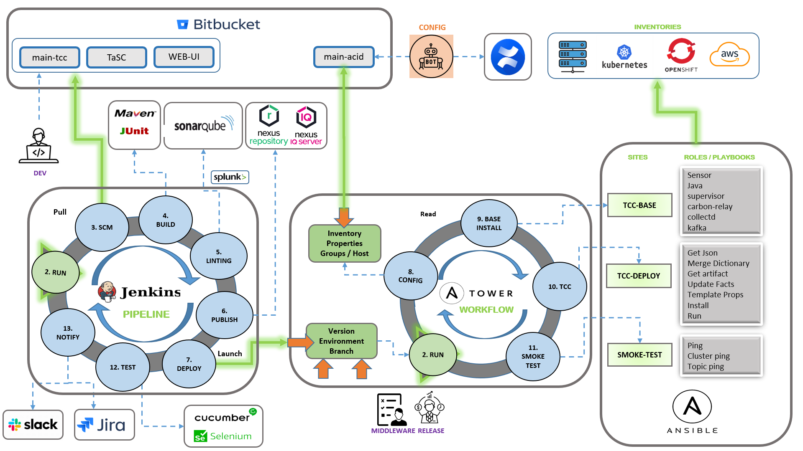

# ⚙️ DevOps Pipeline Demo

## Description
Multi-stage CI/CD pipeline deployed on Azure Container Apps.
Includes Docker image generation, automated deployment, and testing with Playwright.

---

## Diagram

---

## Embedded demo
> 🔗 [See full documentation at](https://github.com/hmosqueraturner/ideal-cicd-one/)

<iframe
  src="https://github.com/hmosqueraturner/ideal-cicd-one/"
  width="100%"
  height="800"
  style="border:none;border-radius:12px;">
</iframe>
---

## Stack
- **Bitbucket Pipelines + Jenkins**
- **Azure Container Apps + Bicep**
- **Playwright + JUnit**
- **Flowise RAG** for automatic test cases validation