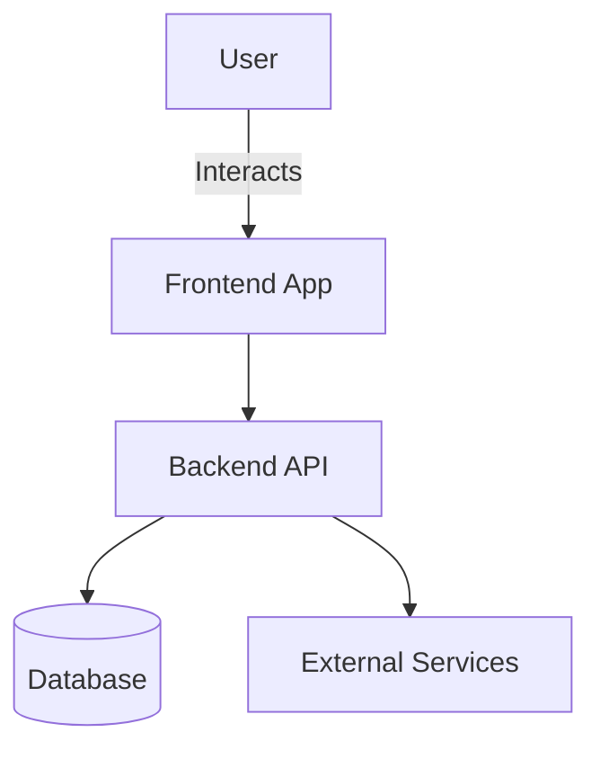

# Release Verifica Bot

## Description
AI Bot to evaluate release content

---

## Architecture (editable)

> 🚧 Real architectures in progress.

---

## Demo / Documentation
🔗 [Open full demo or documentation](https://hmosqueraturner.github.io/release-bot/)

  <iframe
    src="https://hmosqueraturner.github.io/release-bot/"
    style="position:absolute; top:0; left:0; width:100%; height:100%; border:none; border-radius:12px;"
    allowfullscreen
    loading="lazy"
    onerror="this.outerHTML='
⚠️ Could not load the embedded demo.  GitHub may block embedded views. <a href=https://hmosqueraturner.github.io/release-bot/ target=_blank>Open it directly here</a>.
'">
  </iframe>

---

## Tech Stack
- Main language:
- Infrastructure:
- CI/CD:
- Other components:

---

## Notes
> Add design decisions, related links or references here.
