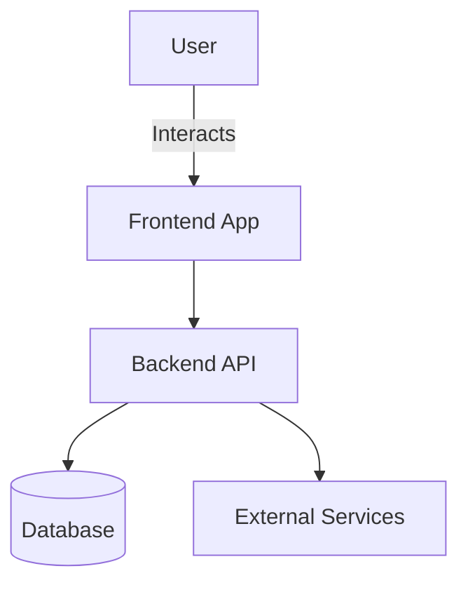

# 🎬 Real-time Omniverse Scene Ctrl

## Description
Visualization of 3D models and multimedia assets using glb/glt or glb + tsx to interact with the content. 

---

## Architecture

> 💡 Architecture details including NVIDIA Omnivrse Workflow.

---

## Demos
🎬 [Demo pure GLB manipulation](https://hmosqueraturner.github.io/scene-controller)
🎬 [Demo GLB + Typescript](https://hmosqueraturner.github.io/scene-controller-types)

## Documentation
🔗 [Open documentation](https://hmosqueraturner.github.io/scene-controller-types)

  <iframe
    src="https://hmosqueraturner.github.io/scene-controller"
    style="position:absolute; top:0; left:0; width:100%; height:100%; border:none; border-radius:12px;"
    allowfullscreen
    loading="lazy"
    onerror="this.outerHTML='
⚠️ Could not load the embedded demo.  GitHub may block embedded views. <a href=https://hmosqueraturner.github.io/scene-controller target=_blank>Open it directly here</a>.
'">
  </iframe>

---

## Tech Stack
- Main language: Typescript
- Infrastructure: Vercel
- CI/CD: Github Actions
- Other components: Nvidia Omniverse, React, Three, Fiber, Vite, Drei

---

## Notes
> Add design decisions, related links or references here.
